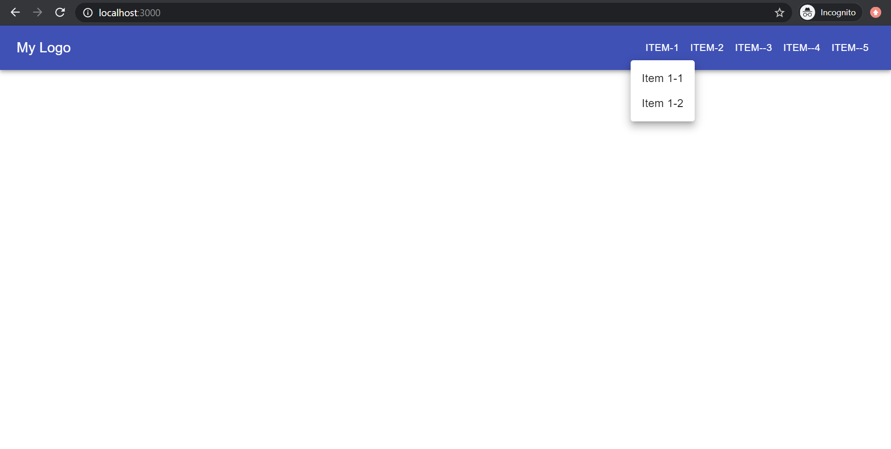
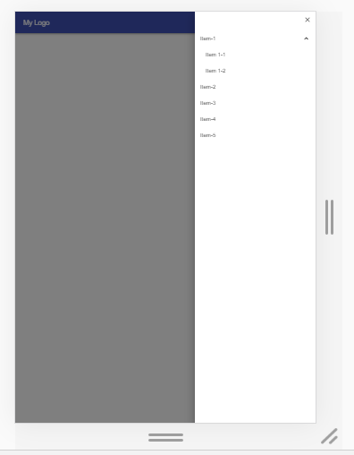

# my-react-components
This project was bootstrapped with [Create React App](https://github.com/facebook/create-react-app).

## Available Scripts

In the project directory, you can run:

### `npm start`

Runs the app in the development mode. 
Open [http://localhost:3000](http://localhost:3000) to view it in the browser.

The page will reload if you make edits. 
You will also see any lint errors in the console.

### Components created
I have used React Material-UI framework
- Responsive Appbar
  - On desktop screen the Appbar looks as follows,
    
  - On small screen devices the Appbar looks as follows,
    
